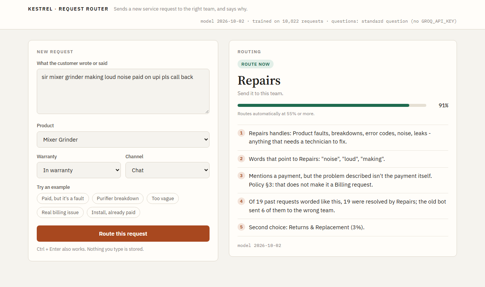

# Kestrel request router

Routes a new Kestrel Home service request to one of the seven service teams, says how sure it is, and gives
reasons an agent can check. When a request is too vague to route ("please call me about my purifier"), it says so
and suggests one question to ask the customer instead of guessing.



It learns from where requests were actually resolved (`resolution_log.final_team`), not from the old routing
bot's queue (`team_label`), because the bot's queue was wrong on 23% of requests. On the three months before the
test period it sends 84.7% of requests to the right team, against 76.7% for the bot.

## Run it

Python 3.9 or newer. No API key needed.

```bash
python -m venv .venv
# Windows: .venv\Scripts\activate    macOS/Linux: source .venv/bin/activate
pip install -r requirements.txt
```

```bash
python -m router serve       # http://127.0.0.1:8000
```

The trained model is included in `models/`, so the service starts straight away. The screen is at
http://127.0.0.1:8000. Its examples cover the cases the service desk raised: a customer who mentions paying for a
repair, a purifier breakdown, and a request too vague to route. `http://127.0.0.1:8000/?example=3` opens straight
onto one.

To retrain, predict or rerun the evidence, copy the data pack's CSVs into `data/` (`train.csv`,
`test_unlabelled.csv`, `resolution_log.csv`, `teams.csv`, `sample_submission.csv`). They are not in the repository
because they are the client's data.

```bash
python -m router train       # a few seconds, rewrites models/router.joblib
```

If your scikit-learn version differs from the one that built the included model, the service retrains itself on
start when the CSVs are in `data/`, and otherwise uses the included model as it is.

### The endpoint

`POST /api/route` takes one request as JSON. Only `request_text` is required.

```bash
curl -X POST http://127.0.0.1:8000/api/route -H "Content-Type: application/json" \
  -d '{"request_text": "mixer grinder making loud noise, paid on upi", "product_family": "Mixer Grinder", "channel": "chat"}'
```

It returns the team, the confidence, `action` (`route` or `ask_first`), the second choice and a list of reasons.
For `ask_first` it adds `ask_customer`, a question to send. Bad input gets a 422 with the field at fault.
`GET /api/health` says whether the model is loaded. Interactive docs are at `/docs`.

### Optional: a question written for each customer

```bash
export GROQ_API_KEY=...          # PowerShell: $env:GROQ_API_KEY="..."
```

With a key, the question for vague requests is worded to fit what the customer wrote, in Hinglish if they wrote in
Hinglish (Groq `openai/gpt-oss-120b`, under Rs 1 a month at Kestrel's volume). Without a key, or if the call
fails, a standard question is used and the response says why. Routing never calls an API.

## Other commands

```bash
python -m router predict          # predictions.csv, plus eval/predictions_detail.csv with confidence
python -m router evaluate         # evidence report: eval/report.md
python tests/test_router.py       # 8 checks, no key needed
```

`python -m router.llm_experiment` reruns the comparison against a hosted model and
`python -m router.llm_experiment questions` measures the question writer's cost. Both need `GROQ_API_KEY`;
their last results are in `eval/llm_experiment.json`.

## How it works

1. `data.py` repairs damaged characters in old Zoho messages, moves Zoho resolution times from UTC to IST and
   merges the two renamed teams onto their current names.
2. `model.py` turns the message, product, warranty status and channel into features and trains a linear SVM.
3. `engine.py` routes one request and builds the reasons: the words that pointed to the team, the Billing rule
   from policy §3 when a customer mentions paying, and how similar past requests actually ended.
4. `service.py` and `static/index.html` are the endpoint and the screen; `clarify.py` writes the question.

`docs/DECISIONS.md` lists each decision, the alternatives and what was thrown away.
`docs/MEMO_TO_RITU.md` is the one page summary for the client. `eval/report.md` is the evidence.

## Layout

```
router/        data cleaning, model, reasons, service, screen
tests/         checks that run without an API key
eval/          evidence report and its data
docs/          decision log, memo, screenshot
data/          the client's export goes here (not tracked)
models/        trained model
```
